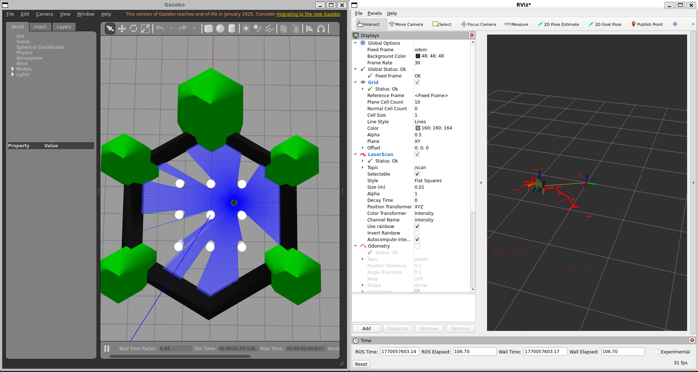

# Simple Custom DWA Local Planner (ROS 2)

This repository contains a simple, custom Dynamic Window Approach (DWA)–style local planner implemented from scratch in ROS 2 using Python.

The aim of this project is to understand how a local planner works internally by directly using LaserScan (/scan) and Odometry (/odom) data to generate safe velocity commands (/cmd_vel) that move a robot toward a goal while avoiding obstacles.

This implementation does NOT use Nav2, costmaps, or any built-in planners. All logic is lightweight and written manually for learning, assignments, and technical evaluations.

-----------------------------------------------------------------------

## Results & Demo

### Simulation Output (Gazebo + RViz)

### Video Demonstration

▶ Click the image above to watch the full demo video on YouTube.

-----------------------------------------------------------------------

## What this project does

- Samples multiple linear and angular velocities
- Predicts short future trajectories for each velocity pair
- Scores trajectories based on goal distance and obstacle presence
- Selects the best trajectory
- Publishes the corresponding /cmd_vel
- Visualizes planning behavior in RViz

-----------------------------------------------------------------------

## Key features

- Custom DWA-style local planner
- Uses raw /scan and /odom (no costmaps)
- Clickable goal support using RViz (/goal_pose)
- Obstacle avoidance using left / front / right laser regions
- RViz visualization:
  - Red lines: candidate trajectories
  - Green line: selected trajectory
- Simple and readable code, easy to explain in interviews

----------------------------------------------------------------------

## Requirements

- ROS 2 (Humble or Iron recommended)
- Python 3
- A robot or simulation publishing:
  - /scan (sensor_msgs/LaserScan)
  - /odom (nav_msgs/Odometry)

Tested with TurtleBot3 in Gazebo.

-----------------------------------------------------------------------

## How it works (high level)

1. Sample possible linear and angular velocities
2. Roll out short trajectories for each sample
3. Compute a cost for each trajectory:
   - Distance to the goal
   - Obstacle bias when an object is in front
4. Choose the lowest-cost trajectory
5. Publish the corresponding velocity command

This loop runs continuously at a fixed control rate.

-----------------------------------------------------------------------

## How to run

### Build the workspace
cd ~/ros2_ws  
colcon build  
source install/setup.bash  

### Launch simulation (example: TurtleBot3)
ros2 launch turtlebot3_gazebo turtlebot3_world.launch.py  

### Run the planner node
ros2 run custom_dwa_planner dwa_node

### Open RViz
rviz2  

RViz setup:
- Fixed Frame: odom
- Add displays:
  - LaserScan -> /scan
  - Marker -> /dwa_trajectories
- Use "2D Goal Pose" to click a navigation goal

-----------------------------------------------------------------------

## Visualization explanation

- Red trajectories: all candidate trajectories evaluated by the planner
- Green trajectory: the selected best trajectory followed by the robot

This visualization shows how the robot makes local navigation decisions.

-----------------------------------------------------------------------

## Notes

- This is a local planner only, not a full navigation stack
- No global planner or Nav2 components are used
- Designed for learning, assignments, and interviews
- Logic is intentionally simple and robust to avoid random behavior

-----------------------------------------------------------------------

## Author

Built as a hands-on project to understand local planning, obstacle avoidance, and trajectory evaluation in ROS 2.
